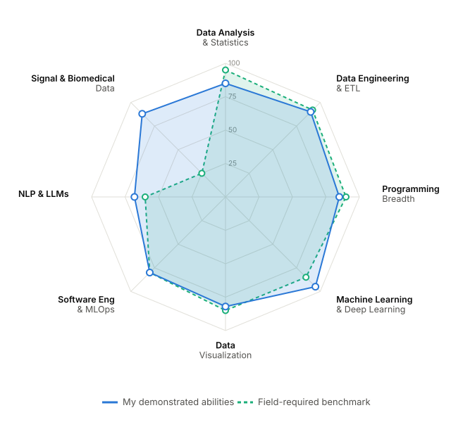

# Gamaliel Mendoza-Cuevas 

**PhD in Neuroscience | Data Science Practitioner**
## Data Engineering, Analysis and Science.

A skills-gap analysis of my demonstrated abilities versus a benchmark of what the field
requires, synthesized from published industry sources. Scores are on a 0–100 scale:
**Mine** = evidence density across my local projects, Claude projects, GitHub repos and
certifications; **Field** = how central each ability is across the Data Engineering,
Analysis and Science roles per the cited sources.

### Abilities vs. field benchmark

  <picture>
    <source media="(prefers-color-scheme: dark)" srcset="skills_radar_dark.svg">
    
  </picture>

<b>Scores &amp; gaps</b> (table view)

| Ability axis | Mine | Field | Δ | Read |
|---|:--:|:--:|:--:|---|
| Data Analysis & Statistics | 85 | 95 | −10 | Development area |
| Programming Breadth | 85 | 90 | −5 | Development area |
| Data Visualization | 82 | 85 | −3 | On benchmark |
| Data Engineering & ETL | 90 | 92 | −2 | On benchmark |
| Software Eng & MLOps | 80 | 80 | 0 | On benchmark |
| NLP & LLMs | 68 | 60 | +8 | Strength |
| Machine Learning & Deep Learning | 95 | 85 | +10 | Strength |
| Signal & Biomedical Data | 88 | 25 | +63 | Domain specialty |

> Sources: local projects (Mex_finance, fmri-analysis-course, fx-flights-tracker, gamindful),
> Claude projects (MusiKloud, TherapIA, de_pipeline), GitHub repos, and certifications
> (Databricks, IBM, Neuromatch, plus PhD/MSc Neuroscience). An interactive radar version
> lives in `Data_Science_Update/skills_gap_analysis.html`.

<b>Referenced skills required by the field</b> (click to expand)

Each axis lists the concrete skills the sources name as required, with citations `[n]`.

**Data Analysis & Statistics** — *field 95 · you 85*
- SQL, joins & aggregations `[4][5]`
- Probability & statistical inference `[3][4]`
- Exploratory data analysis / data wrangling `[3]`
- Regression & hypothesis testing `[3]`
- Excel / spreadsheet analysis `[4][5]`

**Data Engineering & ETL** — *field 92 · you 90*
- Advanced SQL & data modeling `[1][2]`
- ETL/ELT pipelines & integration `[1][2]`
- Data warehousing (Snowflake, BigQuery, Redshift) `[2]`
- Big data (Spark, Kafka, Hadoop) `[1][2]`
- Orchestration (Airflow) & streaming `[2]`

**Programming Breadth** — *field 90 · you 85*
- Python (Pandas, NumPy) `[1][2][3][4]`
- SQL `[1][2][3][4][5]`
- R `[3][5]`
- Scala / Java `[1][2]`

**Machine Learning & Deep Learning** — *field 85 · you 95*
- Regression & classification (logistic, trees, RF, KNN) `[3]`
- Clustering (K-means) `[3]`
- Model evaluation `[3]`
- TensorFlow / PyTorch `[2]`
- ML integration into pipelines `[1]`

**Data Visualization** — *field 85 · you 82*
- BI tools — Tableau, Power BI `[3][4][5]`
- Dashboards & KPIs `[4][5]`
- Data storytelling `[3][5]`
- Excel visualization `[3]`

**Software Eng & MLOps** — *field 80 · you 80*
- Version control & CI/CD `[1][2]`
- Cloud platforms (AWS, Azure, GCP) `[2][3]`
- Data observability & quality testing `[1]`
- Real-time processing `[1]`

**NLP & LLMs** — *field 60 · you 68*
- AI/ML integration `[1]`
- Vector databases & embeddings `[1]`
- LLM / Transformer fine-tuning `[1]`

**Signal & Biomedical Data** — *field 25 · you 88*
- Domain specialty — not a general field requirement

### Sources (web-scraped)

1. Dataquest — [15 Data Engineering Skills You Need](https://www.dataquest.io/blog/data-engineering-skills/)
2. DataCamp — [Essential Data Engineering Skills](https://www.datacamp.com/blog/essential-data-engineering-skills)
3. Coursera — [7 Skills Every Data Scientist Should Have](https://www.coursera.org/articles/data-scientist-skills)
4. Coursera — [In-Demand Data Analyst Skills](https://www.coursera.org/articles/in-demand-data-analyst-skills-to-get-hired)
5. Dataquest — [Data Analyst Skills That Get You Hired](https://www.dataquest.io/blog/data-analyst-skills/)

### CV

  

